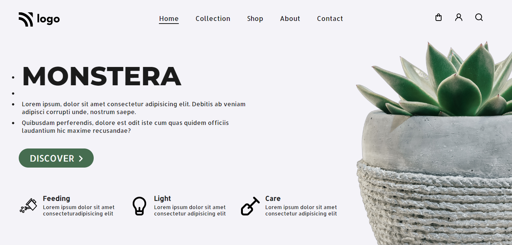

# Portfolio Project 6

## Description

This project is a landing page for a plant shop. It is built using `HTML` and `CSS`.

### Learnings from this project -

- How to create a navigation bar
- How to scale up `svg images` upon being hovered
- How to use CSS `transition` property on a button
- How to position images using `position` property of CSS

### Preview of the project

### [Live link](https://portfolio-project-6-mu.vercel.app/) of the project.
